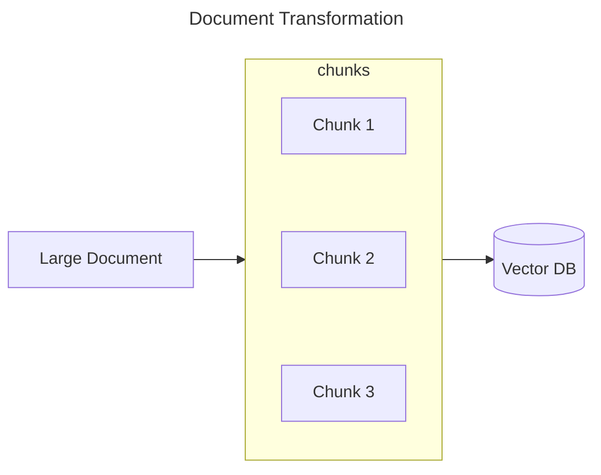
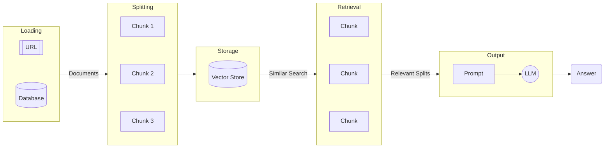

### Document Transformers
In this article we are going to discuss about the document transformers. Basically document transformer is the process in which we split the large documents into multiple smaller chunks so that they can be retrieved easily.

The document transformation seems easy but it becomes complex when you go deeper.

In RAG (Retrieval-Augmented Generation), Knowledge of LLM is extended by providing context of the document. This makes the answer of LLM more reliable and avoids hallucination. The pipeline for converting raw data looks like this in RAG:
1. Loading
2. Splitting
3. Storage
4. Retrieval
5. Generation

reference: 
https://python.langchain.com/docs/use_cases/question_answering/
https://www.promptingguide.ai/techniques/rag
https://python.langchain.com/docs/modules/data_connection/document_transformers/
